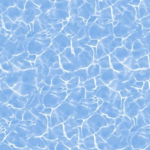
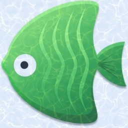
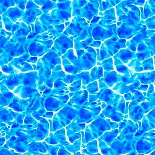

# Práctica 1

1. Realizar la suma ponderada de dos imágenes:      
  
2. Realizar una transicion de dos imaenes usando el operador gamma:  

3. Calcular el histograma unidimensional de los grises de una imagen:  
 
4. Calcular el histograma RG de una imagen en una nueva imagen 64x64:  
 
5. Ecualizar una imagen:  
 
