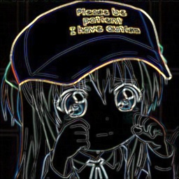
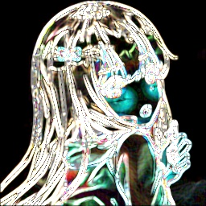

# Práctica 2
### Imágenes base:
     
### 1. Aplicar y conocer el filtro sobel:  
   
### 2. Aplicar y conocer el filtro laplacian:  
   
### 3. Aplicar y conocer el filtro canny:  
   
### 4. Aplicar una suma ponderada de dos imagenes suavizadas por un kernel(blur) para crear una transicion:
  
### 5. Aplicar y conocer los ajustes lineales usando dilatacion y erosion (kernel 3x3):  
   
