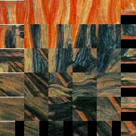

# Práctica 4
### Imagen base

### 1. Utilizar la transformacion en perspectiva (ángulo 30)

### 1. Utilizar la transformacion en perspectiva (vecindad = 5)

### 1. Utilizar la transformacion en perspectiva (vecindad = 40)

